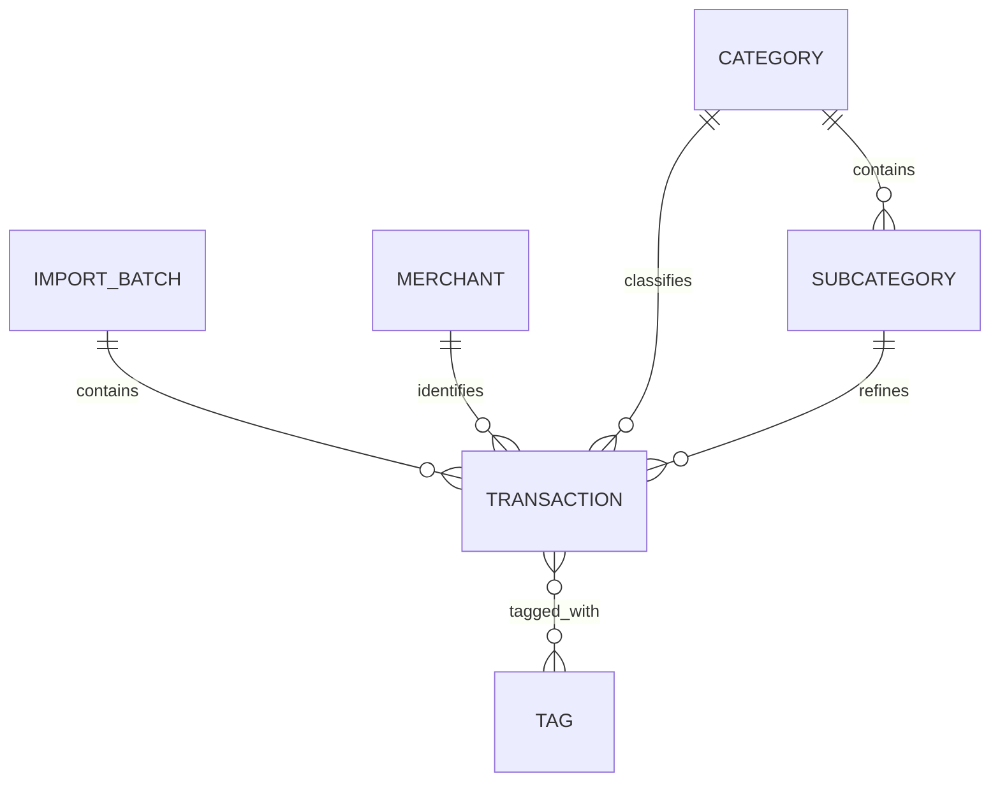

# Rexlet Money v0.1 — Conceptual Data Model

## Purpose

This document describes the conceptual data model for Rexlet Money v0.1.

The goal is to identify the core data entities and relationships required to support transaction ingestion, merchant normalization, user-defined classification, and traceability.

This is a conceptual model. Database-specific implementation details such as PostgreSQL data types, indexes, and constraints will be defined later.

## Core Entities

### ImportBatch

Represents one transaction import operation.

An import batch allows Rexlet to trace transactions back to the import operation that introduced them.

Initial attributes:

* `id`
* `source_filename`
* `imported_at`

Relationship:

* One ImportBatch can contain many Transactions.
* Each imported Transaction belongs to one ImportBatch.

---

### Transaction

Represents a financial transaction imported into Rexlet.

The original source description must be preserved even after normalization and classification.

Initial attributes:

* `id`
* `import_batch_id`
* `transaction_date`
* `amount`
* `currency`
* `raw_description`
* `merchant_id`
* `category_id`
* `subcategory_id`
* `classification_status`
* `created_at`

Possible classification statuses:

* `unclassified`
* `classified`
* `needs_review`

Relationships:

* A Transaction belongs to one ImportBatch.
* A Transaction may reference one Merchant.
* A Transaction may reference one Category.
* A Transaction may reference one Subcategory.
* A Transaction may have many Tags.

---

### Merchant

Represents a normalized merchant identity that can be reused across many transactions.

Example:

Multiple raw descriptions such as:

* `MAX STHLM 018392`
* `MAX UPPSALA 029182`

may both refer to:

`MAX Burgers`

Initial attributes:

* `id`
* `name`
* `created_at`

Relationship:

* One Merchant may be referenced by many Transactions.

---

### Category

Represents a high-level transaction classification.

Examples:

* Food
* Transport
* Housing
* Entertainment

Initial attributes:

* `id`
* `name`
* `created_at`

Relationships:

* One Category may contain many Subcategories.
* One Category may be assigned to many Transactions.

---

### Subcategory

Represents a more specific classification within a Category.

Examples:

* Food → Groceries
* Food → Restaurants
* Transport → Public Transport

Initial attributes:

* `id`
* `category_id`
* `name`
* `created_at`

Relationships:

* Each Subcategory belongs to one Category.
* One Subcategory may be assigned to many Transactions.

A Transaction may have a Category without having a Subcategory.

---

### Tag

Represents optional contextual labels that can be attached to transactions.

Examples:

* Eating out
* Travel
* Work
* Weekend

Initial attributes:

* `id`
* `name`
* `created_at`

Relationship:

* A Transaction may have many Tags.
* A Tag may be assigned to many Transactions.

This creates a many-to-many relationship between Transaction and Tag.

---

### ClassificationRule

Represents a reusable user-defined rule for normalizing and classifying transactions.

Example:

If:

`raw_description contains "MAX"`

then assign:

* Merchant: MAX Burgers
* Category: Food
* Subcategory: Restaurants

Initial attributes:

* `id`
* `match_field`
* `operator`
* `match_value`
* `merchant_id`
* `category_id`
* `subcategory_id`
* `created_at`

Initial matching operators:

* `exact_match`
* `contains`
* `starts_with`

A rule may assign only some classification fields.

For example, a rule may normalize a Merchant without assigning a Category.

## Relationship Overview

ClassificationRule operates on transaction data and may assign normalized and classified values to a Transaction.

## Key Data Modelling Principles

### Preserve source data

Raw source information should not be overwritten by normalized information.

For example:

`raw_description = "MAX STHLM 018392"`

should remain available even when the normalized Merchant is:

`MAX Burgers`

This provides traceability and makes transformations auditable.

### Reuse normalized entities

Merchants, Categories, Subcategories, and Tags should be reusable entities rather than duplicated free-text values across transactions.

### Maintain data integrity

Relationships must remain internally consistent.

For example:

A Subcategory belonging to `Transport` must not be assigned to a Transaction whose Category is `Food`.

### Support incomplete classification

A transaction does not need to be fully classified immediately.

For example:

* Merchant may be unknown.
* Category may be known while Subcategory remains empty.
* Tags are always optional.

This allows Rexlet to represent incomplete or uncertain data without inventing values.

## Out of Scope

The v0.1 conceptual data model does not yet include:

* Users
* Bank accounts
* Bills
* Subscriptions
* Budgets
* Savings goals
* Forecasts
* Documents
* OCR output
* AI models
* Payment information

These entities may be introduced when future product requirements justify them.
